 

    <a href= "astro/sun_calcium.jpg" data-fancybox="cek" data-options='{"caption": "The Sun in  Ca II K.   Observer: Muhammad Yusuf"}'></a>
    <a href= "astro/horsehead.jpg" data-fancybox="cek" data-options='{"caption": "Horsehead Nebula:   Alson know as Barnard 33, Horsehead Nebula is a dark nebula in Orion constellation which has a distance of  1500 light years from the Earth. This image is a composite of  20 x 600s Luminance, 10 x 600s filter R, 10 x 600s filter G, and 10 x 600s filter B, taken in Kupang, East Nusa Tenggara.   Instrument: Teleskop Takahashi FSQ 106ED + CCD SBIG STF8300 + Paramount MyT.   Observer: M. Yusuf"}'>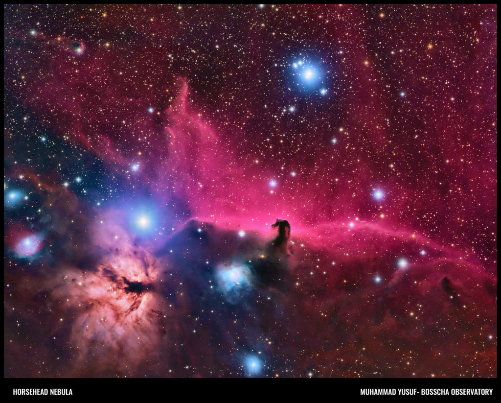</a>
    <a href= "astro/eagle.jpg" data-fancybox="cek" data-options='{"caption": "Eagle Nebula, also known as  Messier 16, NGC 6611) is a young open cluster located in Serpens constellation. This Nebula was discovered by Jean-Phillipe de Cheseaux in 1745-1746. This nebula is also well known as active star forming region.    Observer: Denny Mandey"}'>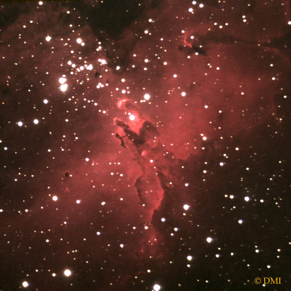</a>
    <a href= "astro/gmt_2016.jpg" data-fancybox="cek" data-options='{"caption": "Total Solar Eclipse 2016.   Observer: Muhammad Yusuf"}'>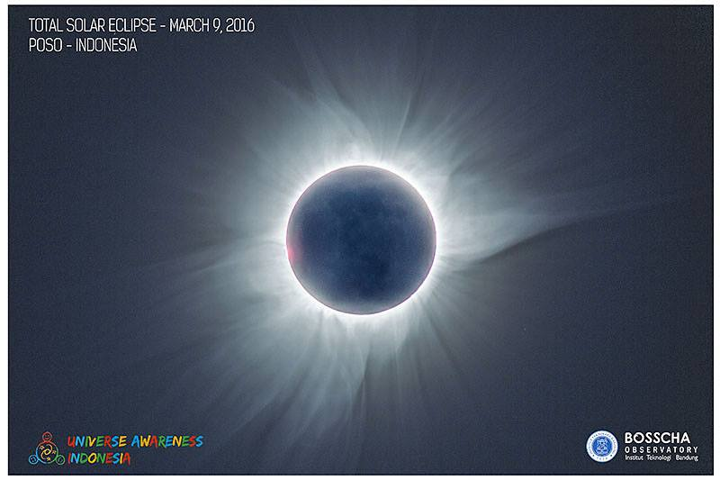</a>
    <a href= "astro/gmt_2016_2.png" data-fancybox="cek" data-options='{"caption": "Total Solar Eclipse 2016.   Observer: M. Yusuf, Agus Triono P.J."}'>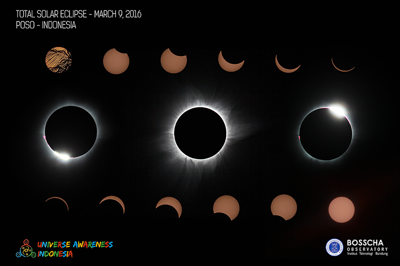</a>
    <a href= "astro/orion.jpg" data-fancybox="cek" data-options='{"caption": "Orion Nebula (also known as Messier 42/NGC 1976) is one of star forming region which can be seen with naked eyes in rural or less light polluted region. It reside at 1344 light year with the diameter of 24 light years.   Observer: Muhammad Yusuf"}'></a>
    <a href= "astro/saturnus.jpg" data-fancybox="cek" data-options='{"caption": "Saturn.   Observer: Evan I. Akbar"}'></a>
    <a href= "astro/sun.png" data-fancybox="cek" data-options='{"caption": "The Sun in  H-alpha   Observer: Muhammad Yusuf"}'></a>
    <a href= "astro/lovejoy.jpg" data-fancybox="cek" data-options='{"caption": "Comet Lovejoy C/2014 Q2.   Observer: M. Yusuf & Agus Triono P.J."}'>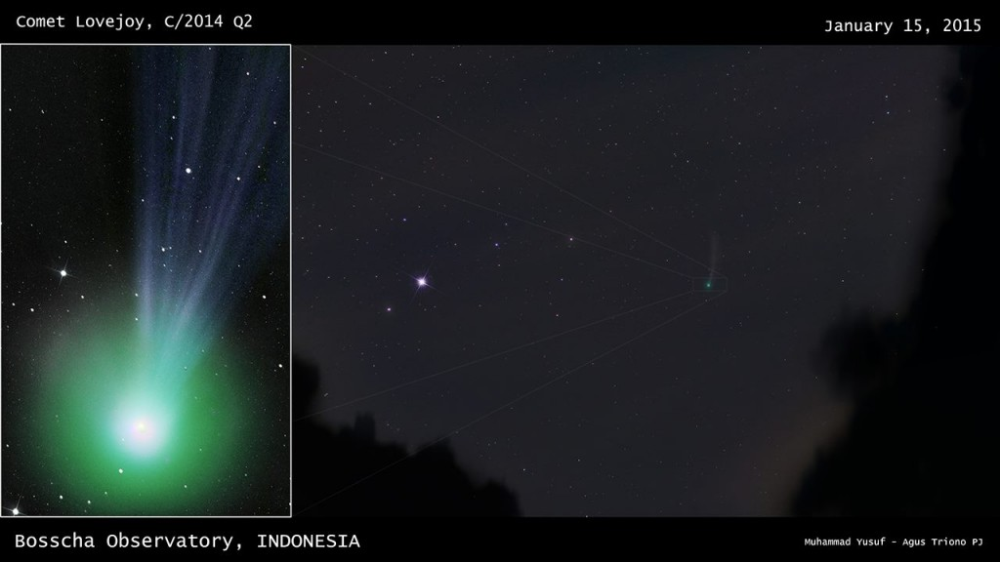</a>
    <a href= "astro/trifid.jpg" data-fancybox="cek" data-options='{"caption": "Trifid Nebula(alson known as Messier 20/NGC 6514) is a  H II region in Sagittarius. This object was found by Charles Messier at  5 June 1764. This nebula could be observerd with small telescope and become one of favorite target for amateur astronomers.   Instrumen: Planewave CDK 14-inch + FLI 11002 + BVR filter.   Observer: Muhammad Yusuf"}'></a>
    <a href= "astro/tro.png" data-fancybox="cek" data-options='{"caption": "Leo Triplet is small group of galaxies in Leo constellation which its distance is 35 million light year. It consists of  M65, M66, and  NGC 3628.   Instrument: Planewave CDK 14-inch + FLI 11002.   Observer: Muhammad Yusuf"}'>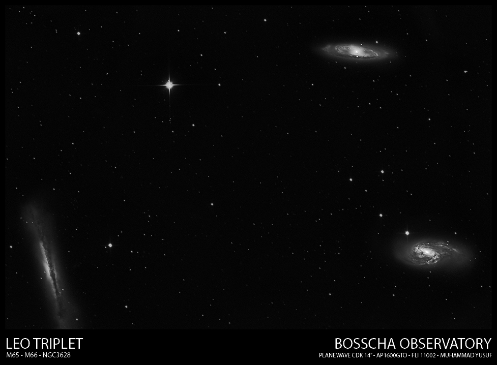</a>
    <a href= "astro/u32_m8-edit.jpg" data-fancybox="cek" data-options='{"caption": "Lagoon Nebula, also known as Messier 8, is interstellar cloud located in Sagittarius. This nebula is found by Giovanni Hodierna in 1654.   Observer: Muhammad Yusuf"}'></a>
    <a href= "astro/u3_triangulum.jpg" data-fancybox="cek" data-options='{"caption": "Triangulum galaxy is a spiral galaxy which reside at 2.73 million light year from the Earth on Triangulum constellation. This galaxy also known as Messier 33/NGC 598. This is the third biggest galaxy in our local group after Milkyway and Andromeda galaxy. This photo was taken in East Nusa Tenggara.   Observer: Muhammad Yusuf"}'>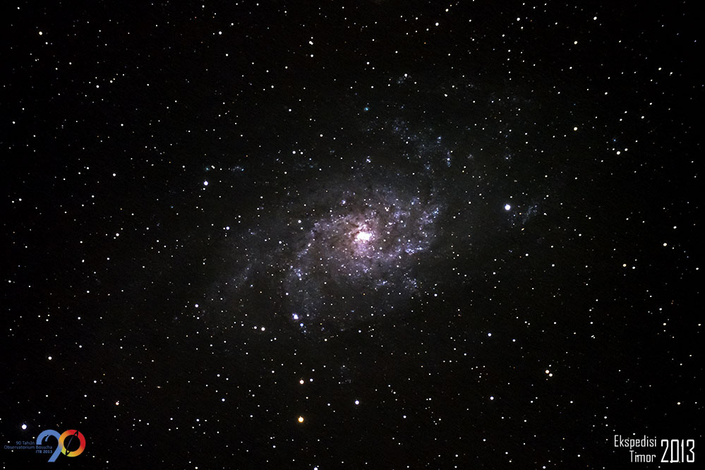</a>
    <a href= "astro/Astro_etacarina.jpg" data-fancybox="cek" data-options='{"caption": "Eta Carinae Nebula is a region in Carina-Sagittarius arm which consists of dark and bright cloud gases. It distance is 8500 light years from the Earth.   Observer: Muhammad Yusuf"}'>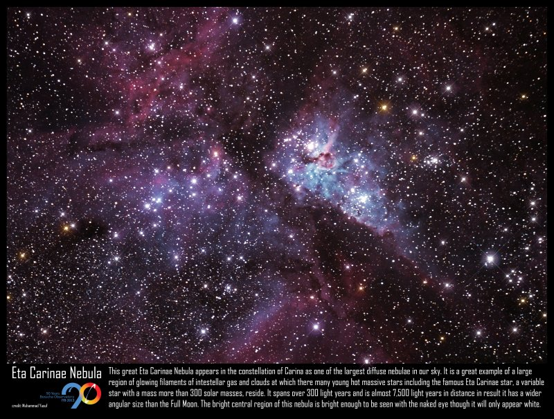</a>
    <a href= "astro/u40_supermoon.jpg" data-fancybox="cek" data-options='{"caption": "<em>Supermoon</em> in 11 August 2014.   Observer: Muhammad Yusuf"}'></a>
    <a href= "astro/u68_southerntrail1200800-1024x683.jpg" data-fancybox="cek" data-options='{"caption": "Star trail around South Celestial Pole, taken in Amfoang Tengah sub-district, East Nusa Tenggara.   Observer: Muhammad Yusuf"}'></a>
    <a href= "astro/u80_kampanye.jpg" data-fancybox="cek" data-options='{"caption": "The center of Milkyway galaxy. The disk of our galaxy with dust and gas band are clearly be seen, and along with that, Scorpio constellation with its red giant, Antares.   Observer: Muhammad Yusuf"}'>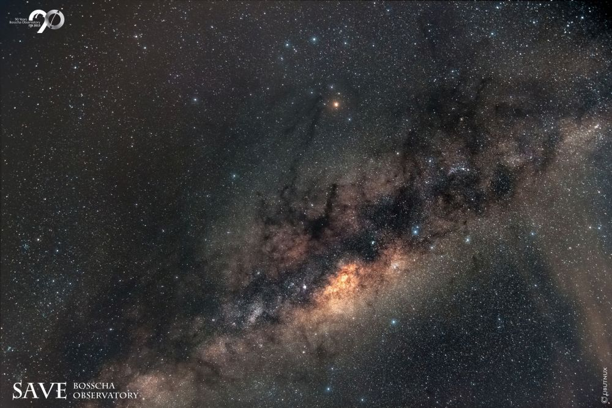</a>
    <a href= "astro/u87_lagoon.jpg" data-fancybox="cek" data-options='{"caption": "Colored version of Lagoon Nebula.   Observer: Muhammad Yusuf"}'>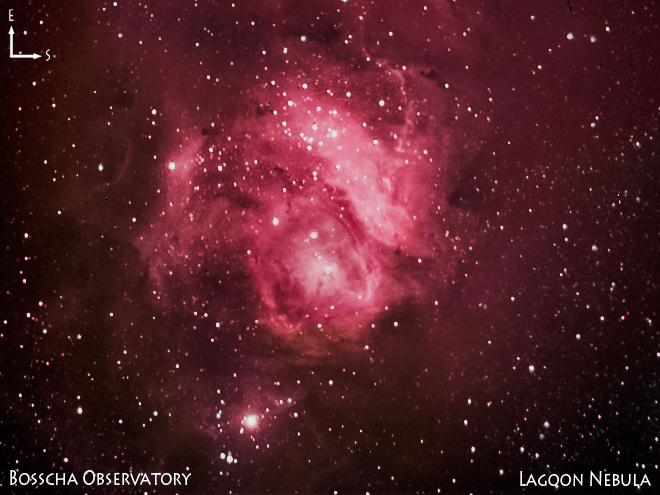</a>
    <a href= "astro/u96_IMG_7964-Edit.jpg" data-fancybox="cek" data-options='{"caption": "Partial Lunar Eclipse   Observer: Muhammad Yusuf"}'></a>
    <a href= "astro/Astro_Pleiades.jpeg" data-fancybox="cek" data-options='{"caption": "Open Cluster Pleiades or M45 in Taurus constellation."}'>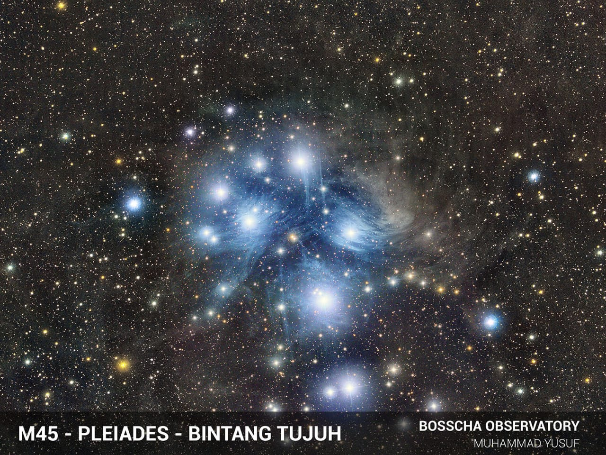</a> 

 

<!--  -->
