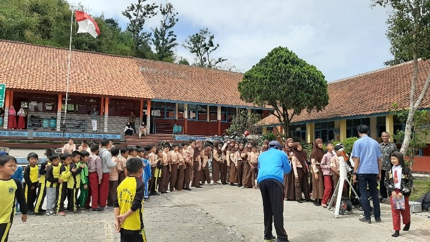
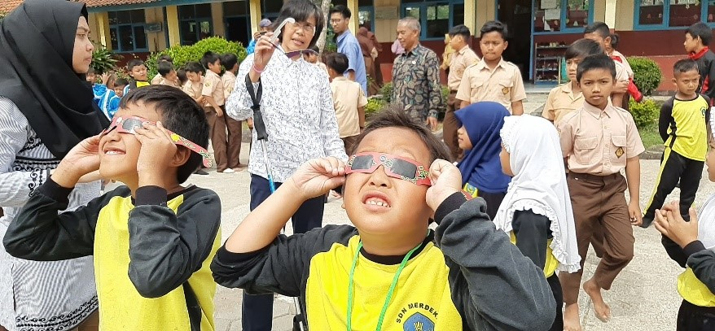

The year 2019 was marked as the 100th anniversary of the International Astronomical Union (IAU). To commemorate many giant leaps and achievements that happened on astronomy developments for the world, IAU ran various programs for all astronomy communities to do, either professionals or astronomy enthusiasts.

One of IAU’s global initiative projects was “Astronomy Day in Schools”, with the vision of mobilizing astronomy communities to hold activities in schools. This was a special opportunity for students to interact directly with astronomers in their community and to learn about many influences of astronomy in our daily life. 

Astronomers, either amateurs or professionals all over the world, were invited to participate in this global campaign. IAU encouraged school visitations that lasted for a week on 10-17 November 2019. Coincidentally during the week, November 10th was The World Science Day for Peace and Development and November 11th was the transit of Mercury, which was visible throughout the world and provided precious chances for visiting astronomers. 

### Astronomy Day in Schools by Bosscha Observatory

As an institution that houses astronomers, Bosscha Observatory cannot be separated from the role of astronomy and science education for the public. On this occasion, astronomers and science communicators from our observatory paid a visit to Pancasila Elementary Schools and Merdeka Elementary School at Lembang that were held separately on November 12th and 14th in each school site. 
During those visitations, several activities were done together with the students and teachers from each school. The activities done were intended to introduce astronomy as science through fun activities, either by Sun observation or astronomy introduction in classes. 

By conducting interactive activities such as Sun observation, we intend to raise the students’ attention and awareness to the natural events around them, by making this as a practice on building a scientific mindset from early ages by giving them real experiences. It appears that students and their teachers were really happy and enjoyed the observation session that used various instruments. Questions about the Sun were also frequently asked to our team members.



<!-- 

  

    
  

  

    
  

 -->

 


After observing the Sun together, we invited the 5th graders to gather in a classroom to do another activity. This time, our astronomers delivered a short presentation to the students about Astronomy 101, which included information about the Earth as our home and a member of our Solar System. We encouraged them to explore more about our planet, its physical characteristics, and phenomenons that occurred using the help of an earth ball. 

Questions about Earth’s position in the Solar System, its size compared to other planets and the Sun, and distances to the Sun, the Moon, and planets were introduced using simple teaching aids. Students’ participation was improved by asking them to directly act out the orbital movements and eclipses configurations that happened in the Earth-Moon-Sun system.











Students were also asked to see the Earth as a whole system, review its role and position to the creatures living on it, and also look at the Earth from afar. Students were invited to examine what the Earth meant for them. 






After the event had ended, the students took a photo together with the astronomers from Bosscha Observatory. 


Here is the gallery of Astronomy Day in Schools activities by the Bosscha Observatory. 

### <u>Pancasila Elementary School, Lembang, November 12, 2019</u> 
##### (Photo credit: Agus Triono P.J.)
---



### <u>Merdeka Elementary School, Lembang, November 14, 2019</u> 
##### (Photo credit: Irfan Imaduddin)
---

