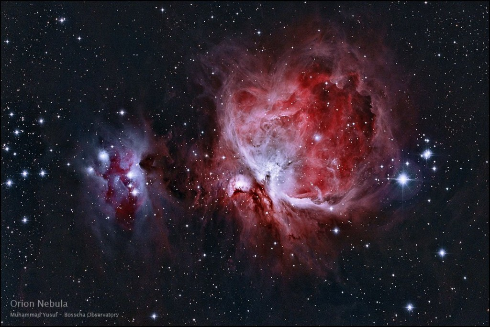
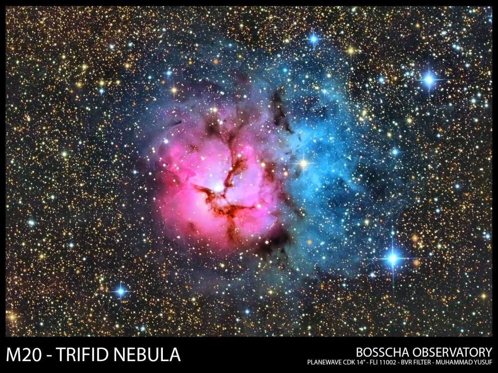

 

    <a href= "astro/sun_calcium.jpg" data-fancybox="cek" data-options='{"caption": "Kenampakan Matahari pada panjang gelombang Ca II K.   Observer: Muhammad Yusuf"}'></a>
    <a href= "astro/horsehead.jpg" data-fancybox="cek" data-options='{"caption": "Horsehead Nebula:   Nebula ini dikenal juga sebagai Barnard 33, merupakan nebula gelap di konstelasi Orion, berjarak 1500 tahun cahaya dari Bumi. Gambar ini merupakan komposit dari 20 x 600s Luminance, 10 x 600s filter R, 10 x 600s filter G, dan 10 x 600s filter B dan diambil di Kupang, NTT.   Instrumen: Teleskop Takahashi FSQ 106ED + CCD SBIG STF8300 + Paramount MyT.   Observer: M. Yusuf"}'></a>
    <a href= "astro/eagle.jpg" data-fancybox="cek" data-options='{"caption": "Nebula Elang (Eagle Nebula, dikenal juga sebagai Messier 16, NGC 6611) merupakan gugus terbuka berusia muda yang berada di konstelasi Serpens. Nebula ini pertama kali ditemukan oleh Jean-Phillipe de Cheseaux pada tahun 1745-1746. Nebula ini dikenal sebagai salah satu tempat pembentukan bintang yang aktif.   Observer: Denny Mandey"}'></a>
    <a href= "astro/gmt_2016.jpg" data-fancybox="cek" data-options='{"caption": "Gerhana Matahari Total 2016.   Observer: Muhammad Yusuf"}'></a>
    <a href= "astro/gmt_2016_2.png" data-fancybox="cek" data-options='{"caption": "Gerhana Matahari Total 2016.   Observer: M. Yusuf, Agus Triono P.J."}'></a>
    <a href= "astro/orion.jpg" data-fancybox="cek" data-options='{"caption": "Nebula Orion (dikenal juga sebagai Messier 42/NGC 1976) merupakan salah satu area pembentukan bintang yang bisa dilihat dengan mata telanjang jika pengamat berada di daerah yang cukup gelap. Nebula Orion berada pada jarak sekitar 1344 tahun cahaya dan memiliki ukuran sekitar 24 tahun cahaya.   Observer: Muhammad Yusuf"}'></a>
    <a href= "astro/saturnus.jpg" data-fancybox="cek" data-options='{"caption": "Planet Saturnus.   Observer: Evan I. Akbar"}'></a>
    <a href= "astro/sun.png" data-fancybox="cek" data-options='{"caption": "Kenampakan Matahari pada panjang gelombang H-alpha   Observer: Muhammad Yusuf"}'></a>
    <a href= "astro/lovejoy.jpg" data-fancybox="cek" data-options='{"caption": "Komet Lovejoy C/2014 Q2.   Observer: M. Yusuf & Agus Triono P.J."}'></a>
    <a href= "astro/trifid.jpg" data-fancybox="cek" data-options='{"caption": "Nebula Trifid (dikenal sebagai Messier 20/NGC 6514) adalah sebuah area H II di rasi Sagittarius. Nebula ini ditemukan oleh Charles Messier pada 5 Juni 1764. Nebula ini bisa diamati dengan teleskop kecil dan menjadi salah satu favorit target pengamatan astronom amatir.   Instrumen: Planewave CDK 14-inch + FLI 11002 + BVR filter.   Observer: Muhammad Yusuf"}'></a>
    <a href= "astro/tro.png" data-fancybox="cek" data-options='{"caption": "Leo Triplet merupakan kumpulan kecil galaksi di konstelasi Leo yang berjarak 35 juta tahun cahaya. Kumpulan galaksi ini terdiri atas galaksi M65, M66, dan NGC 3628.   Instrumen: Planewave CDK 14-inch + FLI 11002.   Observer: Muhammad Yusuf"}'></a>
    <a href= "astro/u32_m8-edit.jpg" data-fancybox="cek" data-options='{"caption": "Nebula Lagoon, dikenal juga sebagai Messier 8, merupakan awan antar bintang besar yang terletak di rasi Sagittarius. Nebula ini pertama kali ditemukan oleh Giovanni Hodierna sekitar tahun 1654.   Observer: Muhammad Yusuf"}'></a>
    <a href= "astro/u3_triangulum.jpg" data-fancybox="cek" data-options='{"caption": "Galaksi Triangulum merupakan galaksi spiral yang berjarak 2,73 juta tahun cahaya dari Bumi, berada di konstelasi Triangulum. Obyek ini juga dikenal sebagai Messier 33/NGC 598. Galaksi ini merupakan galaksi terbesar ke-3 di Local Group kita setelah galaksi Bimasakti dan galaksi Andromeda. Foto di atas diambil saat ekspedisi ke Nusa Tenggara Timur.   Observer: Muhammad Yusuf"}'></a>
    <a href= "astro/Astro_etacarina.jpg" data-fancybox="cek" data-options='{"caption": "Nebula Eta Carinae merupakan sebuah daerah di lengan Carina-Sagittarius yang terdiri dari kumpulan gas gelap dan terang. Jaraknya sekitar 8500 tahun cahaya dari Bumi.   Observer: Muhammad Yusuf"}'></a>
    <a href= "astro/u40_supermoon.jpg" data-fancybox="cek" data-options='{"caption": "Fenomena <em>Supermoon</em> tanggal 11 Agustus 2014.   Observer: Muhammad Yusuf"}'></a>
    <a href= "astro/u68_southerntrail1200800-1024x683.jpg" data-fancybox="cek" data-options='{"caption": "Potret trail bintang di sekitar Kutub Selatan Langit. Diambil di Kantor Kecamatan Amfoang Tengah, Nusa Tenggara Timur.   Observer: Muhammad Yusuf"}'></a>
    <a href= "astro/u80_kampanye.jpg" data-fancybox="cek" data-options='{"caption": "Pusat galaksi Bimasakti. Terlihat piringan galaksi dengan pita debu dan gas yang terkesani baik. Terlihat pula rasi bintang Scorpio dengan bintang raksasa merahnya, Antares.   Observer: Muhammad Yusuf"}'></a>
    <a href= "astro/u87_lagoon.jpg" data-fancybox="cek" data-options='{"caption": "Versi berwarna dari nebula Lagoon. Nebula Lagoon, dikenal juga sebagai Messier 8, merupakan awan antar bintang besar yang terletak di rasi Sagittarius. Nebula ini pertama kali ditemukan oleh Giovanni Hodierna sekitar tahun 1654.   Observer: Muhammad Yusuf"}'></a>
    <a href= "astro/u96_IMG_7964-Edit.jpg" data-fancybox="cek" data-options='{"caption": "Fenomena Gerhana Bulan Sebagian.   Observer: Muhammad Yusuf"}'></a>
     

 

