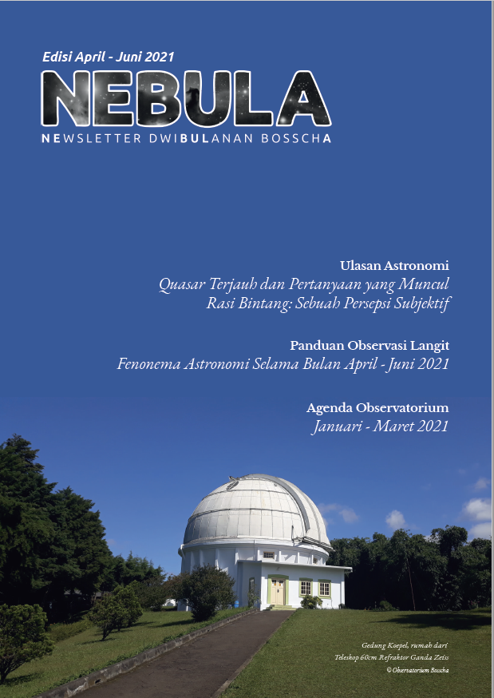

  

    Telah terbit <em>newsletter</em> Observatorium Bosscha untuk edisi pertama. Dengan nama <strong>NEBULA</strong> yang merupakan singkatan dari <strong>Newsletter Tiga-Bulanan Bosscha</strong>, <em>newsletter</em> ini akan terbit sebanyak satu kali dalam selang waktu tiga bulan.  Edisi pertama mencakup bulan April-Juni 2021. Melalui <em>newsletter</em> ini tersemat harapan agar dapat mengisi ruang perhatian pembaca dengan pengetahuan dan berita astronomis. NEBULA memastikan pembaca dapat menikmati dunia astronomi dan memahami rasional saintifknya dengan nyaman. Sambil belajar astronomi, kita tingkatkan minat membaca tuntas dan penuh perhatian.
  

  
  

    
  

Selengkapnya <em>newsletter</em> dapat diunduh pada tautan [berikut]()

