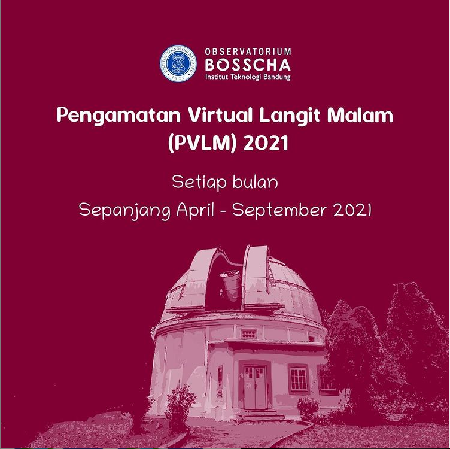

Program Pengamatan Virtual Langit Malam 2020 dipenuhi dengan antusiasme yang sangat tinggi oleh penikmat astronomi di Indonesia. Sehubungan dengan masih belum dibukanya kunjungan ke situs observatorium, Observatorium Bosscha kembali menyediakan program pengamatan virtual langit malam.

Berbeda dengan PVLM 2020, pada tahun ini Observatorium Bosscha melakukan beberapa perubahan terkait teknis program dan penjadwalannya. Lengkapnya silahkan kunjungi tautan [berikut]().

